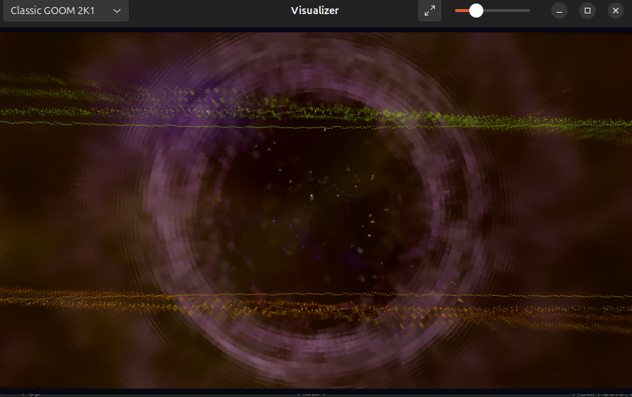
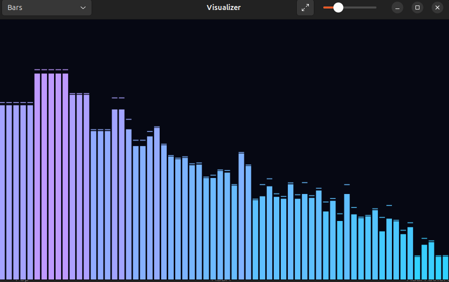
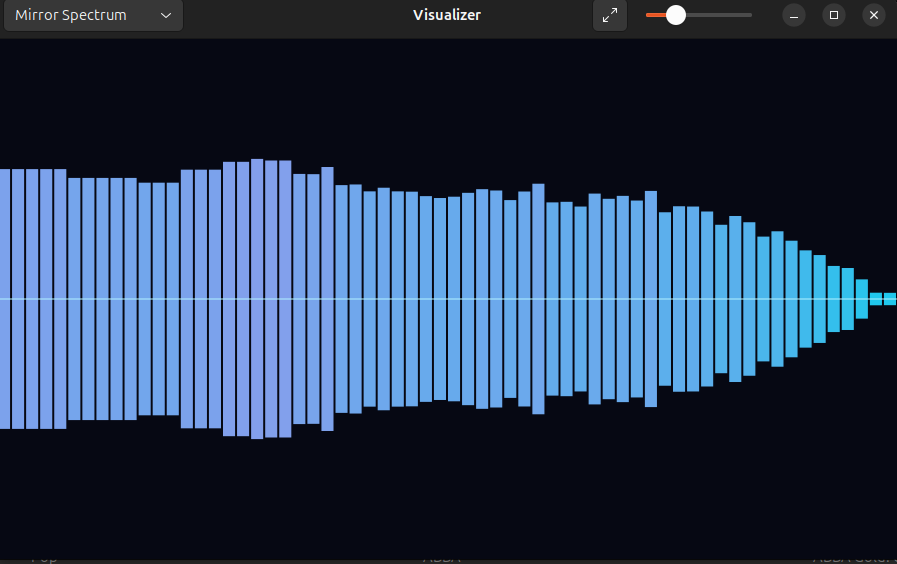

# Rhythmbox Visualizer

[](LICENSE)
[](https://www.python.org/)
[](https://gitlab.gnome.org/GNOME/rhythmbox)
[](https://paypal.me/leandrosb3)

A real-time, audio-reactive visualization plugin for Rhythmbox. It combines a
native Python/GTK renderer with the original GOOM engines used by classic
Rhythmbox releases.

The plugin analyzes the audio currently playing in Rhythmbox. It does not use
the microphone, require an external loopback device, or start a second audio
player.

## Highlights

- Eleven audio-reactive visualization modes.
- Original **GOOM** and **GOOM 2K1** engines rendered at 1280×720.
- 64 logarithmically spaced frequency bands.
- Smooth animation, peak tracking, particles, and radial effects.
- Adjustable sensitivity.
- Fullscreen presentation mode.
- Direct integration with the Rhythmbox **View** menu.
- Support for global playbin and per-stream playback backends.
- No network connection or online account required.

## Screenshots

### Classic GOOM 2K1

<p align="center">
  
</p>

### Native spectrum modes

<table>
  <tr>
    <td align="center" width="50%">
      <br>
      <sub><strong>Bars</strong> — frequency spectrum with peak indicators</sub>
    </td>
    <td align="center" width="50%">
      <br>
      <sub><strong>Mirror Spectrum</strong> — symmetrical center spectrum</sub>
    </td>
  </tr>
</table>

## Visualization modes

| Mode | Description |
| --- | --- |
| **Bars** | Traditional frequency bars with animated peak indicators. |
| **Mirror Spectrum** | Symmetrical spectrum expanding from the center line. |
| **Wave** | Mirrored neon waveform derived from the frequency bands. |
| **Circular** | Rotating radial spectrum with audio-reactive rays. |
| **Pulse Rings** | Concentric rings driven by bass and midrange energy. |
| **Neon Tunnel** | Animated perspective tunnel whose speed follows the music. |
| **Particles** | Bass-triggered particles emitted from the center of the screen. |
| **Frequency Mountains** | Layered frequency landscapes with translucent depth. |
| **Digital Rain** | Frequency-driven columns inspired by digital rain. |
| **Classic GOOM** | The original psychedelic GStreamer GOOM visualizer. |
| **Classic GOOM 2K1** | The alternate classic GOOM 2K1 visualizer. |

The classic engines render at **1280×720** and target **30 FPS**. Only the
selected GOOM engine is active, reducing CPU usage when switching between the
classic modes or returning to a native animation.

## Requirements

- Rhythmbox 3.x
- Python 3
- GTK 3
- PyGObject
- Pycairo and the PyGObject Cairo bridge
- GStreamer 1.x
- GStreamer Good Plugins, including `spectrum`, `goom`, and `goom2k1`

Install the required runtime packages on Ubuntu or Debian with:

```bash
sudo apt update
sudo apt install rhythmbox python3-gi python3-gi-cairo \
  gstreamer1.0-plugins-base gstreamer1.0-plugins-good
```

Package names may differ on other Linux distributions.

## Installation

Clone or download the repository, open its directory, and run the included
installer:

```bash
chmod +x install.sh
./install.sh
```

The installer copies the plugin to:

```text
~/.local/share/rhythmbox/plugins/visualizer
```

It also detects sandboxed editor environments that replace `XDG_DATA_HOME`,
preventing accidental installation inside a private Snap directory.

After installation:

1. Close every running Rhythmbox window.
2. Start Rhythmbox again.
3. Open **Tools → Plugins**.
4. Enable **Visualizer**.
5. Start playing a track.
6. Open **View → Visualizer**.

## Usage

Choose an effect from the selector in the visualizer header bar. Use the slider
to increase or decrease the response to quieter recordings.

| Control | Action |
| --- | --- |
| Mode selector | Changes the active visualization. |
| Sensitivity slider | Adjusts the spectrum response. |
| Fullscreen button | Enters or leaves fullscreen mode. |
| `F11` | Toggles fullscreen mode. |
| `Esc` | Leaves fullscreen mode. |

## How it works

The plugin inserts a non-destructive GStreamer filter into Rhythmbox's active
audio pipeline. Audio samples are converted to a known floating-point format
and observed directly through a pad probe.

The native modes use a lightweight frequency analysis and a Cairo renderer.
The classic modes branch the same audio stream into the installed GOOM engines,
convert their video output into GTK-compatible pixel buffers, and display only
the latest available frame. Frame delivery is bounded so the GTK event loop
cannot be overwhelmed by stale video frames.

```text
Rhythmbox audio
      │
      ├── Frequency analyzer ── Native Cairo visualizations
      │
      ├── GOOM ──────────────── Classic GOOM frames
      │
      └── GOOM 2K1 ─────────── Classic GOOM 2K1 frames
```

Only one classic video branch is enabled at a time. The normal Rhythmbox audio
path remains connected throughout visualization and mode changes.

## Troubleshooting

### The plugin does not appear

Confirm that these files exist:

```bash
ls ~/.local/share/rhythmbox/plugins/visualizer
```

The directory should contain `visualizer.py` and `visualizer.plugin`. Restart
Rhythmbox after installing or updating the plugin.

### The window is blank

Install the GTK/Cairo bridge and restart Rhythmbox:

```bash
sudo apt install python3-gi-cairo
```

### The graphics are visible but do not react to audio

Start a new track after enabling the plugin. Some Rhythmbox backends create
their per-stream filters only when playback begins.

### Classic GOOM is unavailable

Check that both engines are installed:

```bash
gst-inspect-1.0 goom
gst-inspect-1.0 goom2k1
```

On Ubuntu and Debian they are normally provided by
`gstreamer1.0-plugins-good`.

### Inspecting Rhythmbox errors

Recent plugin and GStreamer messages can be viewed with:

```bash
journalctl --user --since "10 minutes ago" | grep -i rhythmbox
```

## Development

Check Python and installer syntax:

```bash
python3 -m py_compile visualizer.py
bash -n install.sh
```

The project intentionally uses the system GTK, PyGObject, and GStreamer
packages because it runs inside the Rhythmbox process. A Python virtual
environment will generally not expose the same GI typelibs and multimedia
plugins as the desktop application.

When modifying the plugin, rerun `./install.sh` and restart Rhythmbox. Libpeas
loads Python modules into the application process, so overwriting the installed
file alone does not reload an active plugin.

## Support the project

If you enjoy Rhythmbox Visualizer and would like to support its continued
development, you can make a donation through PayPal:

[](https://paypal.me/leandrosb3)

Every contribution is appreciated and helps fund testing, maintenance, and new
visual effects.

## License

Rhythmbox Visualizer is free software released under the
[GNU General Public License v3.0](LICENSE). You may use, study, modify, and
redistribute it under the terms of that license.

Rhythmbox is a separate GNOME project. GOOM, GStreamer, GTK, and other named
projects remain the property of their respective authors.
